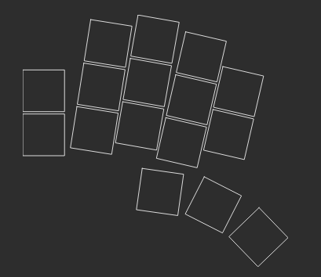

# skully

A split, wireless, ergo keybaord inspired by weteor's [3w6](https://github.com/weteor/3W6) and built with MrZealot's [ergogen](https://github.com/ergogen/ergogen).

The overall shape of one side reminded me of a skull, thus the name and silkscreen

